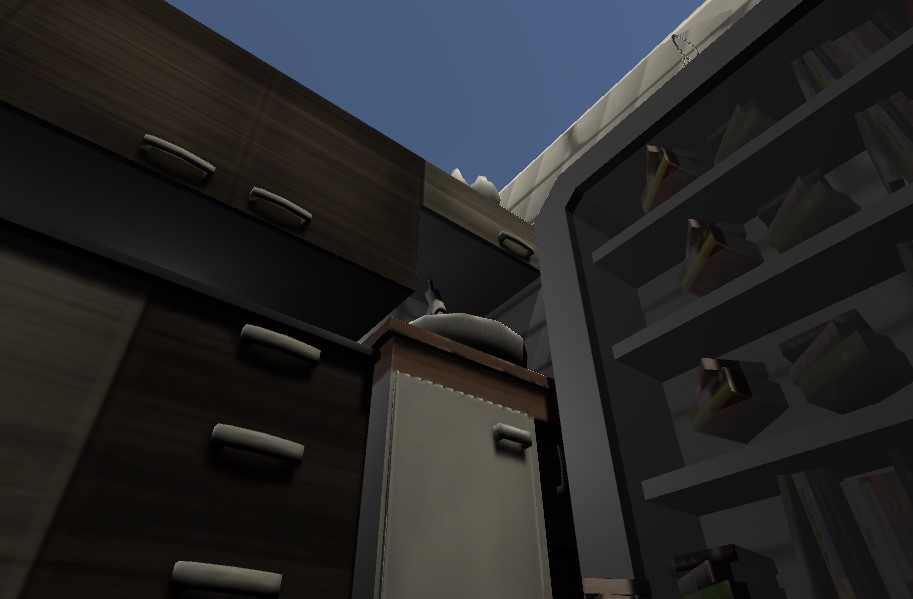
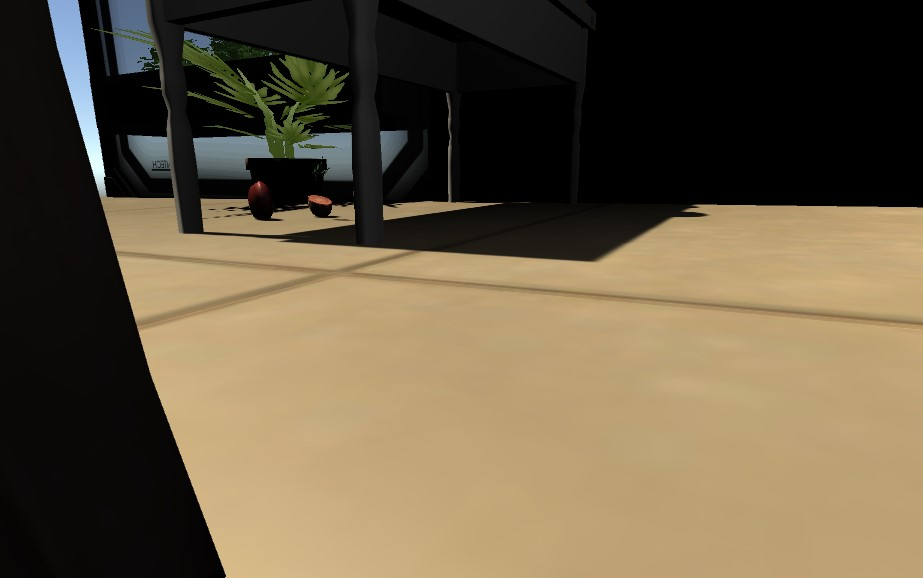
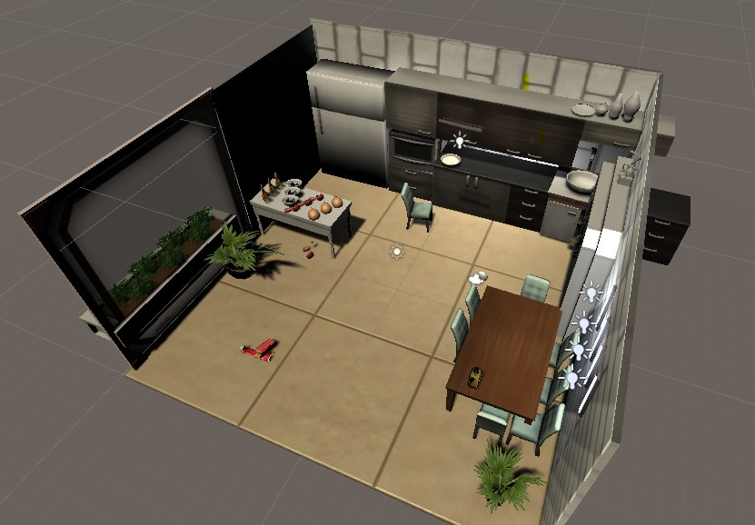
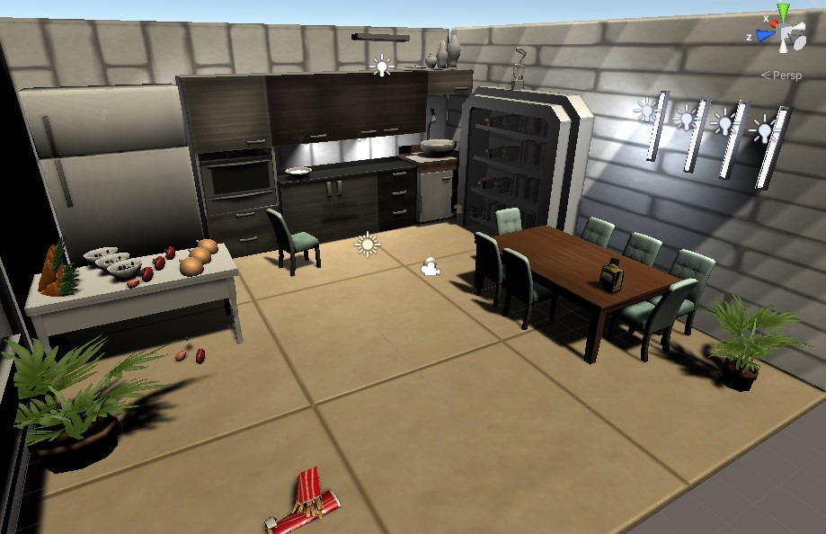
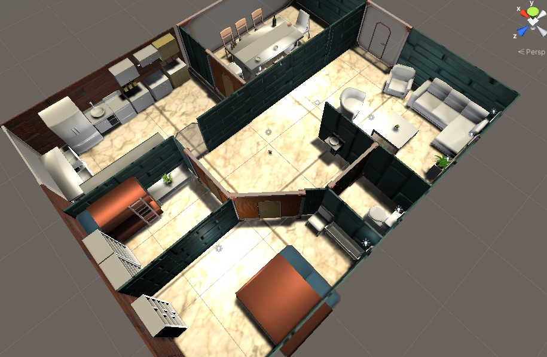

# House mouse 
# Come to discover hidden worlds:
 
 https://michaly.itch.io/house-mouse
 

to experince your house in a new way, through the eyes of of the mouse that you so despise. this way you can understand what is truly happening in your home. sudenly ordinary things will take a different appearance, the kitchen, bathroom and bedroom will turn to an adventure. you will have to traverse the familiar but unfamiliar house and find your way arround while thinking outside the box to find food sneaking past the landlord and earning rewords.  
 
 
 
## Menu screen

In the menu screen you will see three options : 
 
1. play - 
2. Options - 
3. Quit - 
 
 ## How to play?

• Mouse - Moving the mouse can change the angle of view of the player.

 # first level:

# The rest of the house:

