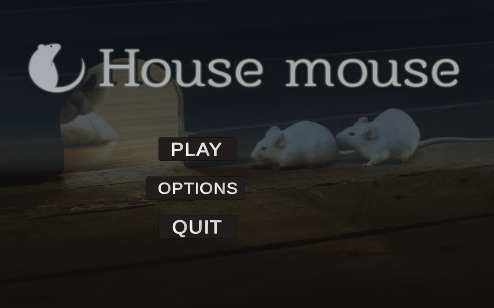
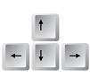

# House mouse 
# Come to discover hidden worlds:
 
 https://michaly.itch.io/house-mouse
 

to experince your house in a new way, through the eyes of of the mouse that you so despise. this way you can understand what is truly happening in your home. sudenly ordinary things will take a different appearance, the kitchen, bathroom and bedroom will turn to an adventure. you will have to traverse the familiar but unfamiliar house and find your way arround while thinking outside the box to find food sneaking past the landlord and earning rewords.  
 
 
 
## Menu screen

In the menu screen you will see three options : 
 
1. play - by selecting play, you will enter the game .
2. Options - By entering "options" , you will see an option to change the volume.
3. Quit - by selecting quit, you will exit the game .
 
 ## How to play?

   - By pressing the arrow keys, you can move around the room.
By pressing the space bar the player will jump.

  - Moving the mouse can change the angle of view of the player.

 # first level:
 
-  Goal : Your goal as a player is to collect foods in the space. Once you eat the food, the score will rise.
 
 

# The rest of the house:

